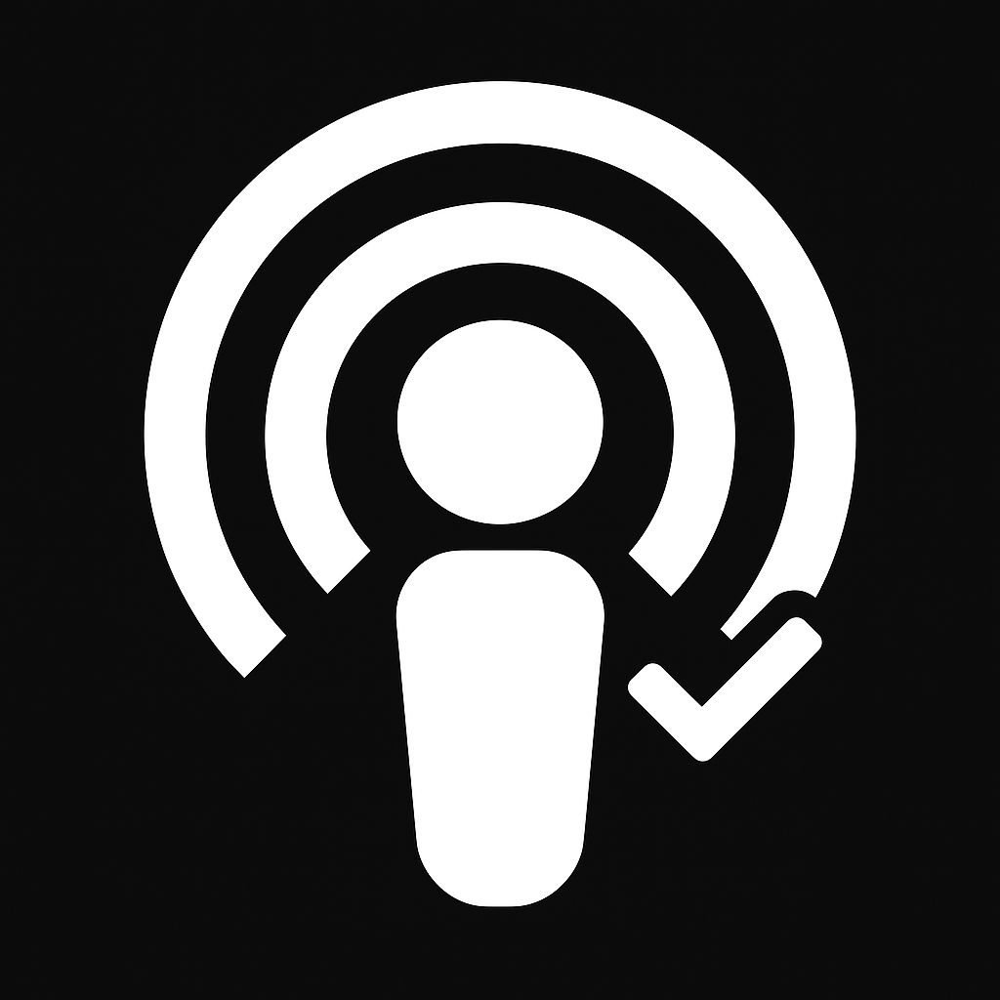

<!-- Improved compatibility of back to top link: See: https://github.com/othneildrew/Best-README-Template/pull/73 -->

<!--
*** Thanks for checking out the Best-README-Template. If you have a suggestion
*** that would make this better, please fork the repo and create a pull request
*** or simply open an issue with the tag "enhancement".
*** Don't forget to give the project a star!
*** Thanks again! Now go create something AMAZING! :D
-->

<!-- PROJECT SHIELDS -->
<!--
*** I'm using markdown "reference style" links for readability.
*** Reference links are enclosed in brackets [ ] instead of parentheses ( ).
*** See the bottom of this document for the declaration of the reference variables
*** for contributors-url, forks-url, etc. This is an optional, concise syntax you may use.
*** https://www.markdownguide.org/basic-syntax/#reference-style-links
-->
[![Contributors][contributors-shield]][contributors-url]
[![Forks][forks-shield]][forks-url]
[![Stargazers][stars-shield]][stars-url]
[![Issues][issues-shield]][issues-url]
[![MIT][license-shield]][license-url]
[![LinkedIn][linkedin-shield]][linkedin-url]

<!-- PROJECT LOGO -->
 

  

<h3 align="center">CleanCast</h3>

  

    Podcasting, purified
     
    CleanCast 
     
    <a href="https://github.com/ikoyhn/go-podcast-sponsor-block"><strong>Explore the docs »</strong></a>
     
     
    <a href="https://github.com/ikoyhn/go-podcast-sponsor-block">View Demo</a>
    &middot;
    <a href="https://github.com/ikoyhn/go-podcast-sponsor-block/issues/new?labels=bug&template=bug-report---.md">Report Bug</a>
    &middot;
    <a href="https://github.com/ikoyhn/go-podcast-sponsor-block/issues/new?labels=enhancement&template=feature-request---.md">Request Feature</a>
  

<!-- TABLE OF CONTENTS -->

  
Table of Contents

  <ol>
    <li>
      <a href="#about-the-project">About The Project</a>
      <ul>
        <li><a href="#built-with">Built With</a></li>
      </ul>
    </li>
    <li>
      <a href="#getting-started">Getting Started</a>
      <ul>
        <li><a href="#prerequisites">Prerequisites</a></li>
        <li><a href="#installation">Installation</a></li>
      </ul>
    </li>
    <li><a href="#usage">Usage</a></li>
    <li><a href="#roadmap">Roadmap</a></li>
    <li><a href="#contributing">Contributing</a></li>
    <li><a href="#license">License</a></li>
    <li><a href="#contact">Contact</a></li>
    <li><a href="#acknowledgments">Acknowledgments</a></li>
  </ol>

<!-- ABOUT THE PROJECT -->
## About The Project

This is a GO Docker application that will take any podcast that is on Youtube and will generate a RSS feed with the audio only and all sponsored sections auto removed. The actual podcasts episodes are downloaded on demand from youtube when the user requests the specific episode then it is served to the user seamlessly.

(<a href="#readme-top">back to top</a>)

### Built With

* [![Golang][golang.com]][golang-url]

(<a href="#readme-top">back to top</a>)

<!-- GETTING STARTED -->
## Getting Started

Below is a guide to get the application running

### Prerequisites

1. Generate a Youtube api v3 key [here](https://developers.google.com/youtube/v3/getting-started)
2. Install Docker
3. Need some podcasts you like

### Running the App

1. Build out your Docker run command (For more Docker variables and compose examples go [here](https://github.com/ikoyhn/go-podcast-sponsor-block/blob/main/DOCKER-CONFIG.md))
    - > docker run -p 8080:8080 -e GOOGLE_API_KEY=<api key here> -v <audio download path here>:/config ikoyhn/go-podcast-sponsor-block
2. Run the command to start the app up

(<a href="#readme-top">back to top</a>)

<!-- USAGE EXAMPLES -->
## Usage

 1. Find your ID
	-  **Playlist ID**: To find this navigate to the channel and either click the podcast tab or playlist tab and click on the playlist you want to add. Ex TigerBelly the url you should see after clicking it will be www.youtube.com/playlist?list=PLbh0Jamvptwfp_qc439PLuyKJ-tWUt222` so the ID would be `PLbh0Jamvptwfp_qc439PLuyKJ-tWUt222`
			
	 - **Channel ID**: If you want to create a podcast from all videos from a channel use this. You can get the channel ID using websites such as https://www.tunepocket.com/youtube-channel-id-finder/.

  
2. Build your URL
	-  **Playlist**: If you are building a podcast URL using a playlist use the `/rss`endpoint. * Following the TigerBelly example where this app is running on `http://localhost:8080` the url would be `http://localhost:8080/rss/PLbh0Jamvptwfp_qc439PLuyKJ-tWUt222`
			
	 - **Channel**: If you are building a podcast URL using a channel ID use the `/channel` endpoint. An example would be `http://localhost:8080/channel/UCoj1ZgGoSBoonNZqMsVUfAA`

*  **NOTE:** If you have the docker var `-e TOKEN=<secure token>` set you must add the token as a query param to this url. Ex: `http://localhost:8080/rss/PLbh0Jamvptwfp_qc439PLuyKJ-tWUt222?token=secureToken`

3. With this URL you can now add this to any of your favorite podcast apps that accept custom RSS feeds (Apple Podcasts app, VLC Media Player, etc)

(<a href="#readme-top">back to top</a>)

<!-- ROADMAP -->
## Roadmap

- [x] Playlists
- [x] Channels
- [ ] Add UI for easier URL generation
    - [ ] Discovery Page of new podcasts based on Apple Podcast API
    - [ ] Managing saved podcasts
    - [ ] Allow user to set docker variables in UI
- [ ] Improve YT API Efficiency
    - [ ] Add user defined max videos to grab
    - [ ] Allow for multiple YT API keys 
- [ ] Implement proper authenticaton (Username/Password)
- [ ] Create IOS App (stretch goal)
- [ ] Create Android App (stretch goal)

See the [open issues](https://github.com/ikoyhn/go-podcast-sponsor-block/issues) for a full list of proposed features (and known issues).

(<a href="#readme-top">back to top</a>)

<!-- CONTRIBUTING -->
## Contributing

Contributions are what make the open source community such an amazing place to learn, inspire, and create. Any contributions you make are **greatly appreciated**.

If you have a suggestion that would make this better, please fork the repo and create a pull request. You can also simply open an issue with the tag "enhancement".
Don't forget to give the project a star! Thanks again!

1. Fork the Project
2. Create your Feature Branch (`git checkout -b feature/AmazingFeature`)
3. Commit your Changes (`git commit -m 'Add some AmazingFeature'`)
4. Push to the Branch (`git push origin feature/AmazingFeature`)
5. Open a Pull Request

(<a href="#readme-top">back to top</a>)

### Top contributors:

<!-- LICENSE -->
## License

Distributed under the MIT. See `LICENSE.txt` for more information.

(<a href="#readme-top">back to top</a>)

<!-- CONTACT -->
## Contact

Jared Lynch - jaredlynch13@gmail.com.com

Project Link: [https://github.com/ikoyhn/go-podcast-sponsor-block](https://github.com/ikoyhn/go-podcast-sponsor-block)

(<a href="#readme-top">back to top</a>)

<!-- ACKNOWLEDGMENTS -->
## Acknowledgments

* [Irstanley/go-ytdlp](https://github.com/lrstanley/go-ytdlp) for downloading Youtube videos (includes Sponsorblock for removing sponsored segments)
* [google-api-go-client](https://github.com/googleapis/google-api-go-client) Used to get all information for Youtube Podcast

(<a href="#readme-top">back to top</a>)

<!-- MARKDOWN LINKS & IMAGES -->
<!-- https://www.markdownguide.org/basic-syntax/#reference-style-links -->
[contributors-shield]: https://img.shields.io/github/contributors/ikoyhn/go-podcast-sponsor-block.svg?style=for-the-badge
[contributors-url]: https://github.com/ikoyhn/go-podcast-sponsor-block/graphs/contributors
[forks-shield]: https://img.shields.io/github/forks/ikoyhn/go-podcast-sponsor-block.svg?style=for-the-badge
[forks-url]: https://github.com/ikoyhn/go-podcast-sponsor-block/network/members
[stars-shield]: https://img.shields.io/github/stars/ikoyhn/go-podcast-sponsor-block.svg?style=for-the-badge
[stars-url]: https://github.com/ikoyhn/go-podcast-sponsor-block/stargazers
[issues-shield]: https://img.shields.io/github/issues/ikoyhn/go-podcast-sponsor-block.svg?style=for-the-badge
[issues-url]: https://github.com/ikoyhn/go-podcast-sponsor-block/issues
[license-shield]: https://img.shields.io/github/license/ikoyhn/go-podcast-sponsor-block.svg?style=for-the-badge
[license-url]: https://github.com/ikoyhn/go-podcast-sponsor-block/blob/master/LICENSE.txt
[linkedin-shield]: https://img.shields.io/badge/-LinkedIn-black.svg?style=for-the-badge&logo=linkedin&colorB=555
[linkedin-url]: https://linkedin.com/in/jared-lynch-1998
[golang.com]: https://img.shields.io/badge/Go-00ADD8?logo=Go&logoColor=white&style=for-the-badge
[golang-url]: https://go.dev